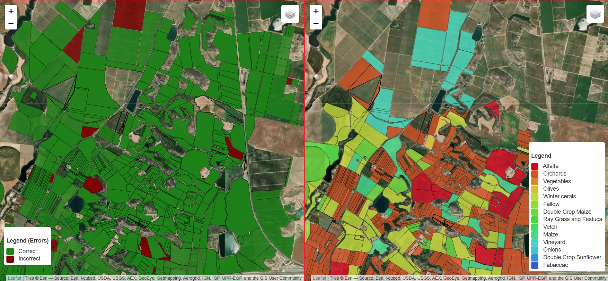

# CatCrops - Crop Type Classification Library

This repository contains the implementation of CatCrops, which is used in the scientific paper: 
 
> **"Early Crop Type Classification and Mapping Combining Remote Sensing and Ancillary Data"**  
> *by Gené-Mola, J., Pamies-Sans, M., Minuesa, C., Casadesús, J., and Bellvert, J. (2025, submitted).*
 
The README will be expanded upon the publication of the corresponding research paper.

CatCrops is a Python library for early crop type classification using remote sensing and ancillary data.  It utilizes Sentinel-2 satellite data, previous crop history, and irrigation system information, among other features, to enhance classification accuracy. The Transformer model is used for time series analysis. 

## Repository Structure

The CatCrops repository is structured as follows:
```tree
CatCrops/
├── catcrops/                       # Core library containing dataset handling, models, and transformations
│   ├── datasets/                   # Dataset utilities
│   │   ├── catcrops.py             # Functions for dataset loading and processing
│   │   └── __init__.py
│   ├── models/                     # Implementation of deep learning models
│   │   ├── __init__.py
│   │   ├── LongShortTermMemory.py  # LSTM model
│   │   ├── MSResNet.py             # Multi-Scale ResNet model
│   │   ├── OmniScaleCNN.py         # Omni-Scale CNN model
│   │   ├── StarRNN.py              # Star RNN model
│   │   ├── TempCNN.py              # Temporal CNN model
│   │   └── TransformerModel.py     # Transformer-based model
│   ├── evaluation_utils.py         # Utility functions for model evaluation
│   ├── transforms.py               # Data transformation utilities
│   └── __init__.py
│
├── processing/                     # Scripts for data processing, training, and testing
│   ├── download_dataset.py         # Script to download and prepare the dataset
│   ├── gee_S2_download.py          # Script to retrieve Sentinel-2 data using Google Earth Engine
│   ├── RESULTS/                    # Directory for storing trained models
│   │   └── Trial00/
│   │       └── model_78.pth        # Example trained model checkpoint
│   ├── TEST/                       # Directory for test results
│   ├── test.py                     # Script for testing the model
│   └── train.py                    # Script for training the model
│
├── docs/                           # Documentation and additional resources
│   ├── CatCrops_Dataset.md         # Dataset documentation
│   └── catcrops_map.jpg            # Image for README visualization
│
├── env_catcrops.yml                # Conda environment file with dependencies
├── env_catcrops_nocuda.yml         # Alternative Conda environment file without CUDA
├── requirements.txt                # List of Python dependencies
├── setup.py                        # Setup script for installing the package
├── LICENSE                         # License file
└── README.md                       # Project documentation
```


## Instalation
To ensure proper functionality, we recommend using Anaconda to manage dependencies. Follow these steps to install the 
required environment and the CatCrops library.

#### 1. Clone the Repository  
First, clone the CatCrops repository from GitHub: 
```bash
git clone https://github.com/UEA-Irta/CatCrops.git
```

#### 2. Install Anaconda  
If you don’t have Anaconda installed, download and install it from the [Anaconda Official Website](https://www.anaconda.com/products/distribution#download-section).  
Once installed, you can verify the installation by running the following command:  

```bash
conda --version
```

#### 3. Create and Activate the Conda Environment  
Navigate to the root directory of the repository and create the environment using the [env_catcrops.yml](env_catcrops.yml) file:  
```bash
conda env create -f env_catcrops.yml
```

Then, activate the environment:  
```bash
conda activate catcrops_env
```

#### 4. Install CatCrops from setup.py  
Once the environment is activated, install the CatCrops library:  
```bash
pip install ./
```

This will install CatCrops in editable mode, meaning any modifications in the source code will be reflected 
immediately without needing to reinstall.

#### 5. Verify the Installation  
To confirm that everything is installed correctly, run:  
```bash
python -c "import catcrops; print('CatCrops installed successfully')"  
```
Now, CatCrops is ready to use within your Anaconda environment.


## CatCrops Dataset

The CatCrops Dataset is hosted on Kaggle and can be accessed through the [CatCrops Dataset on Kaggle](https://www.kaggle.com/datasets/irtaremotesensing/catcrops-dataset)

For direct download, use the following link: 
* [Download CatCrops Dataset](https://www.kaggle.com/api/v1/datasets/download/irtaremotesensing/catcrops-dataset-csv)

If you prefer a lighter version of the dataset, you can download the pre-processed version with the HDF5 files 
already generated from the following link: 
* [Download Lightweight CatCrops Dataset](https://www.kaggle.com/api/v1/datasets/download/irtaremotesensing/catcrops-dataset-hd5)


### How to Download and Extract the Dataset Automatically
You can automatically download and extract the dataset using the script [download_dataset.py](processing/download_dataset.py).

Navigate to the [`\processing`](processing) folder and execute:
```bash
python download_dataset.py --url "https://www.kaggle.com/api/v1/datasets/download/irtaremotesensing/catcrops-dataset-csv" --zip_path "catcrops_dataset.zip" --extract_folder "./"
```

### Dataset Structure

The CatCrops Dataset follows this directory structure:

```tree
<root>                           # Root directory of the dataset
│── codes.csv                    # Mapping of crop types with codes, descriptions, and groups
│── classmapping.csv             # Maps crop types to database classification types
│── sregadiumapping.csv          # Maps irrigation system codes to descriptions
│── varietatmapping.csv          # Maps crop variety codes to descriptions
│── municipismapping.csv         # Maps municipalities to their region and province
│── <year>                       # Directory for each dataset year (e.g., 2022, 2023, ...)
│   ├── <region>.shp             # Shapefile containing parcel boundaries and crop type information
│   ├── <region>_d.csv           # CSV file with additional parcel metadata (e.g., irrigation, elevation)
│   ├── <level>                  # Sentinel-2 processing level (L2A)
│   │   ├── <region>.csv         # Summary CSV file linking parcel IDs to time series files
│   │   ├── <region>.h5          # HDF5 file storing compressed time series data for the region
│   │   ├── <region>             # Folder containing time series data for each parcel
│   │   │   ├── <csv>            # Subdirectory containing individual time series files
│   │   │   │   ├── 123123.csv   # Time Series Table for parcel 123123
│   │   │   │   ├── 123125.csv   # Time Series Table for parcel 123125
│   │   │   │   ├── ...
```

For more information about the dataset structure, refer to [CatCrops_Dataset.md](docs/CatCrops_Dataset.md), which 
explains how the dataset is organized.


## Usage examples

To run an example of training and testing using the CatCrops library, follow these steps. All commands must be 
executed from the [`\processing`](processing) directory.

#### 1. Download the Dataset  
If you have not yet downloaded the dataset, first run:
```bash
python download_dataset.py --url "https://www.kaggle.com/api/v1/datasets/download/irtaremotesensing/catcrops-dataset-csv" --zip_path "catcrops_dataset.zip" --extract_folder "./"
```
#### 2. Train a Model  
Once the dataset is available, you can train a model using [train.py](processing/train.py):
```bash
python train.py --model "TransformerEncoder" --datecrop 'random' -b 512 -e 120 -m "evaluation1" -D "./catcrops_dataset/" --weight-decay 5e-08 --learning-rate 1e-3 --preload-ram -l "./RESULTS" --use_previous_year_TS --sparse --cp --doa  --L2A --pclassid --pcrop --pvar --sreg --mun --com --prov --elev --slope --trial "Trial01"
```

#### 3. Run a Test  
After training, you can evaluate the model using [test.py](processing/test.py):
```bash
python test.py --model "TransformerEncoder" --datecrop "31/07/2023" -b 512 -m "test2023" -D "./catcrops_dataset/" --weight-decay 5e-08 --learning-rate 1e-3 --preload-ram -l "./RESULTS" --use_previous_year_TS --sparse --cp --doa --L2A --pclassid --pcrop --pvar --sreg --mun --com --prov --elev --slope --do_shp --trial "Trial01"
```

#### 4. Running a Test Using a Pre-Trained Model  
A pre-trained model is already available in the repository, so if you want to run a test without training a new model, execute:
```bash
python test.py --model "TransformerEncoder" --datecrop "31/07/2023" -b 512 -e 78 -m "test2023" -D "./catcrops_dataset/" --weight-decay 5e-08 --learning-rate 1e-3 --preload-ram -l "./RESULTS" --use_previous_year_TS --sparse --cp --doa --L2A --pclassid --pcrop --pvar --sreg --mun --com --prov --elev --slope --do_shp --trial "Trial00"
```

## Generated Files

### Training Output Files
The [train.py](processing/train.py) script generates the following files:
* `model_<epoch number>.pth` → Trained model saved at a specific epoch.
* `trainlog.csv` → Contains statistical metrics for each trained model.

### Testing Output Files
The [test.py](processing/test.py) script generates the following files for each zone (ll: Lleida, bt: Baix Ter, t: both zones together):
* `<zone>_cf_prediction.png/csv` → Confusion matrix of predictions in image (.png) and CSV (.csv) formats.
* `<zone>_cf_true.png/csv` → Confusion matrix of actual crop types (ground truth).
* `<zone>_cf_values.png/csv` → Confusion matrix with total occurrences of each class.
* `<zone>_cf_all.png/csv` → Confusion matrix with percentage-based representation of classification results.
* `<zone>_classification_report.txt` → Detailed classification metrics per crop type (precision, recall, F1-score).
* `<zone>_y_pred.npy` → Numpy array storing predicted crop types for the test set.
* `<zone>_y_score.npy` → Numpy array with confidence scores for each prediction in the test set.
* `<zone>_y_true.npy` → Numpy array containing actual crop types (ground truth) for the test set.
* `<zone>_fields_ids.npy` → Numpy array mapping field IDs to their corresponding predictions.
* `scores_allz.csv` → Summary file comparing classification statistics across different test zones.
* `shp/<zone>_pred.shp` → Shapefile containing vector data of agricultural parcels, including previous information and model predictions.

## Sentinel-2 Data Download

To download Sentinel-2 data using [Google Earth Engine](https://earthengine.google.com/), the script 
[gee_S2_download.py](processing/gee_S2_download.py) is used. This script allows you to retrieve Sentinel-2 imagery 
directly from Google Earth Engine for further processing.

To use this script, ensure that Google Earth Engine is installed and properly configured on your system. Once set up, 
navigate to the [`\processing`](processing) directory and execute:

```bash
python gee_S2_download.py
```

This will start the data download process according to the predefined parameters in the script.

### Example: Download Sentinel-2 Data for Lleida (2023)
If you want to download Sentinel-2 data for the **Lleida region** corresponding to the **2023 dataset**, navigate to
the [`\processing`](processing) directory and run:

```bash
python gee_S2_download.py -Z lleida -A 2023 -I 20220101 -F 2024010 -D ./catcrops_dataset
```

#### Explanation of the Arguments  
- `-Z lleida` → Specifies the **study area** (e.g., Lleida).  
- `-A 2023` → Defines the **year** of the dataset.  
- `-I 20220101` → Sets the **start date** (format: YYYYMMDD).  
- `-F 20240101` → Sets the **end date** (one day after the last date to retrieve data, format: YYYYMMDD).  
- `-D ./catcrops_dataset` → Specifies the **dataset folder**.  

#### Additional Options  
- `-N <number>` → Defines the **number of parcels per subset to download at once**.  
- `-B` → Enables **appending new data** to existing files.  
- `-O` → Enables **overwriting existing files**.  
- `-E <error_folder>` → Specifies the **path to save error logs** for parcels that could not be downloaded. If set to None, no error files will be saved.


## Interactive Map

You can explore the crop classification results on the [CatCrops Interactive Map](https://catcrops2023.irtav7.cat/)
[](https://catcrops2023.irtav7.cat/)


## Acknowledgment
* The BreizhCrops repository ([BreizhCrops GitHub](https://github.com/dl4sits/BreizhCrops)) has been used as a starting 
    point for the development of `CatCrops`. We used its dataset structure as a reference to design and organize the 
    CatCrops Dataset, adapting it to our specific needs. The only scripts that remain unchanged from the original 
    BreizhCrops repository are those that define the different deep learning models.

* The data from the DUN has ben obtained from the [Mapa de cultius DUN-SIGPAC](https://agricultura.gencat.cat/ca/ambits/desenvolupament-rural/sigpac/mapa-cultius/index.html)
  of the Department d'Agricultura, Ramaderia, Pesca i Alimentació de la Generalitat de Catalunya.


## Reference
> **"Early Crop Type Classification and Mapping Combining Remote Sensing and Ancillary Data"**  
> *by Gené-Mola, J., Pamies-Sans, M., Minuesa, C., Casadesús, J., and Bellvert, J. (2025, submitted).*


## Contact
For issues or feature requests, please contact: jordi.gene@irta.cat, magi.pamies@irta.cat.